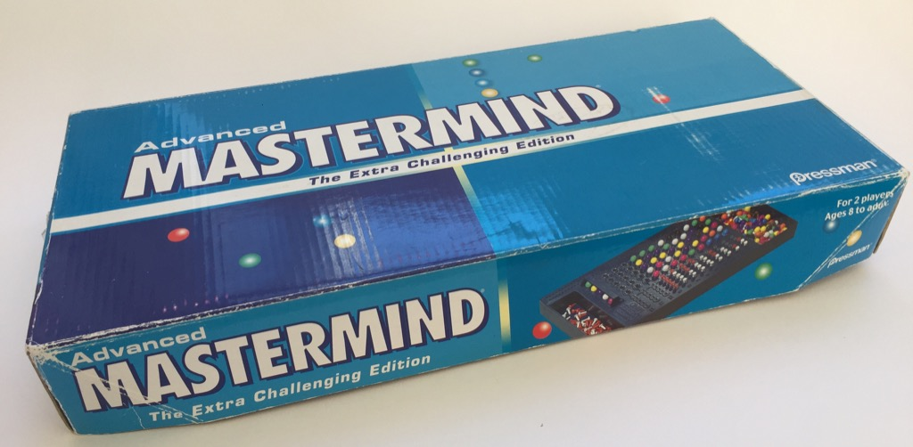

# REACH Project: Mastermind

This is a command line implementation of the board game Mastermind written by Paul Knowles in Python as a coding exercise for the LinkedIn REACH program.

I was recently given the original, analog board game version of Mastermind which I have played a few times with my 7-year-old.
While playing it, I did start to consider how I would program this game in Python. Luckily, I was familiar with the game and had done a little bit of program design in my head before being given this project.

## Table of Contents:

1. [Game Overview](README.md#game-overview)
2. [Game Rules](README.md#game-rules)
3. [Code Explanation](READme.md#code-explanation)
4. [Challenges](README.md#challenges)
5. [Next Steps](README.md#next-steps)
6. [Takeaways](README.md#takeaways)

# Game Overview

To run this game on your local machine, clone this repo and simply run the mastermind.py file from the command line.

You will need Python 3.5, the requests package, and an internet connection.

# Game Rules

At the start of the game, the computer will randomly select a pattern of four different numbers (duplicates allowed) from a total of 8 different numbers. The player will then have 10 chances to correctly guess the pattern.

After each guess, the computer will provide feedback whether the player had: 
 * guessed a number correctly, and/or 
 * guessed a number and position correctly

The computer will not tell you which numbers you guessed correctly! You must use a combination of skill, luck and deductive reasoning to win!

Example game play:
If the pattern was [4, 5, 6, 7]
and you guessed    [7, 5, 1, 2]

The computer will tell you:
Correct number and position: 1, Correct number only: 1

Which means:
you got one number and position right (5)
you got one number right (7) but in the wrong position

# Code Explanation

The entire game is contained inside the mastermind.py file, except for the libraries imported and the API call.

The file starts with importing the necessary dependencies from the python libraries.

The functions within mastermind.py and their uses are:

  * getRandomPattern - performs a call to the www.random.org/integers API to obtain random integers for the pattern to be guessed.

  * checkGuess - compares the guess to the pattern and returns the count of correct numbers only and correct numbers in the correct position.
  
  * guessInRange - checks if the guess contains numbers in the range of numbers which the random pattern is drawn from.
  
  * giveHint  - (unfinished) generates a hint for the user if they are stuck. 
  
  * getGuess - takes input from the user and verifies it meets the requirements of the game (integer, in range, and correct length)
  
  * setParameters - (unfinished) changes the parameters of the game (pattern size, pattern range, number of guesses, etc)
  
  * shuffleWord - shuffles the letters of a word in place then display the unshuffled word after a set number of shuffles. A simple purely decorative, little function. 
  
  * clear - clears the screen. Operting system agnostic function I found on [stackoverflow](https://stackoverflow.com/questions/517970/how-to-clear-the-interpreter-console).
  
  * startGame - the driver which contains the default game parameter values and puts it all together
  
  
# Challenges

Understanding the rules of this game can be a challenge, luckily having learned to play it recently I already understood the rules and games ojectives.

The first challenge was ensuring accurate input from the user that satisfied the requirements of a "guess" that could be compared to the pattern (same length, in range, nubmers only).

The second challenge was to successfully compare the "guess" to the "pattern". Initially the code was reporting more matches than there acutally were and I had to modify my approach. First I thought if I checked for "number and position" then "number only" that would catch all cases. But that approach didn't account for a "number and position" match later in the "pattern" and gave a false positive for a "number only" match that was earlier in the pattern. Ultimately I made a copy of the "pattern" and "guess", removed the "number and position" matches then compared the remaining values to determine "number only" matches.

The third challenge was unpacking the dictionary of guess results and displaying them in an effective way for the player to use them to make better guesses.

Overall, I really enjoyed creating this on a timeline and look forward to adding more to it.

# Next Steps

* Complete the setParameters function to allow players to change parameters of the game. This could use a couple of nice helper functions to reduce redundant code to check for good inputs (numbers in certain range, etc.)

* Complete giveHint function to give player hints. I'm excited about the range this function could cover: If there are no guesses, it could randomly help suggest a number. If there are guesses, based on guesses it could help guide the player to which numbers were correct or tell them which ones were close. 

* Publish to a webpage so anyone can play without downloading and running the .py file.

* Ultimately, add graphics and GUI.

# Takeaways

Even a relatively simple game in which I know the rules can take quite a bit of time to program, and requires a good plan and execution.
Next time I would try to anticipate the need for helper functions to reduce redundant code. Also, I wished I had used the word "position" instead of "location" from the outset, which I had to replace later on as it was a more clear word to use.

